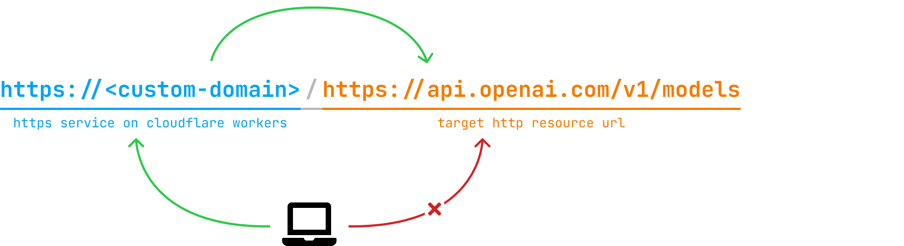

# Cloudflare Workers Proxy

使用 [Cloudflare Workers](https://developers.cloudflare.com/workers/) 代理 HTTP 请求。



## 部署

点击下面的按钮直接部署：

[](https://deploy.workers.cloudflare.com/?url=https://github.com/sherluok/cloudflare-workers-proxy.git)

如果需要用户名密码或其它功能，则先二次开发再通过命令行部署：

```sh
git clone https://github.com/sherluok/cloudflare-workers-proxy.git
cd cloudflare-workers-proxy
npm install
npm run dev
npm run deploy
```

#### 开启用户名密码

在项目根目录下创建 `.env` 文件并写入：

```diff
+ USERNAME="xxxxxxxx"
+ PASSWORD="xxxxxxxx"
```

## References

- https://developers.cloudflare.com/workers/
- https://developers.cloudflare.com/workers/wrangler/
- https://developers.cloudflare.com/workers/languages/typescript/